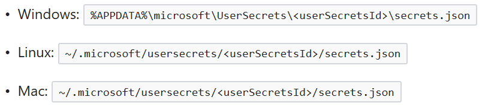
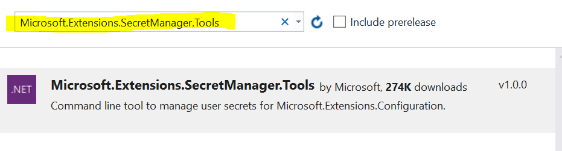
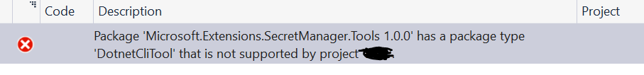
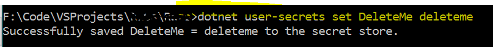
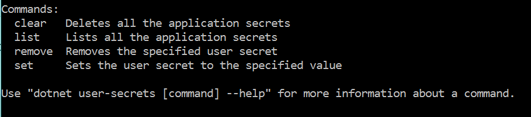
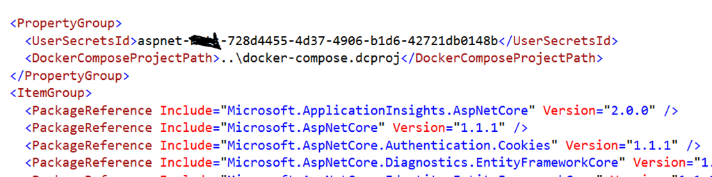
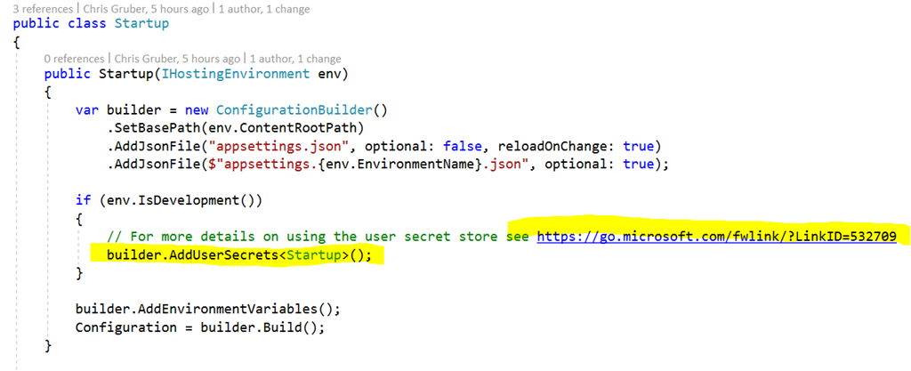
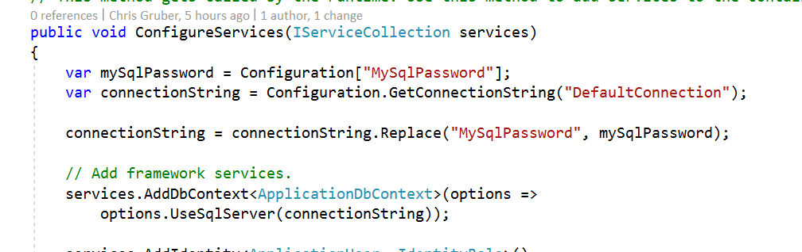
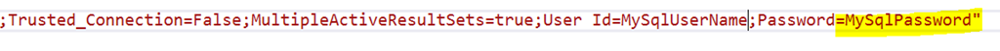

I admit right now that I titled this article to be click bait. I am not going to be revealing any tabloid rumors or dark secrets about ASP.NET Core, but totally call me if you want to share a few. Instead, I am going to explain how to make use of the Secret Manager in ASP.NET Core.

The Secret Manager is a tool in ASP.NET Core that assists you, the developer, in storing any sensitive data you might have that your project needs but you don't want to store it in your GitHub repository for all the world to see (think SQL user credentials).

When you store your “secrets” with Secret Manager, your data is saved as key value pairs inside a non-encrypted (plain text) JSON file that is saved inside your user profile directory if you are on a Windows operating system or beneath a hidden directory created in your project’s root directory called “.microsoft”. Specifically, these locations depending on what your operating system is.

If you are using Linux or MacOS to code your project on or maybe you think you may, you will likely want to add the folder “.microsoft” to your “.gitignore” file to ensure your “secrets” aren’t accidentally committed to your Git repository. It is a common practice within JavaScript developer circles to have a “secrets.json” file and to add “secrets.json” to your “.gitignore” file.

When you save your “secrets” using this feature, you can drop out to your favorite command prompt or terminal session and use this command:

For example, say you have a secret key called “MySecret” and its value you want to save is “mindyourownbusiness”, you can save this key-value pair on your secrets.json file by typing:

    “dotnet user-secrets set MySecret mindyourownbusiness”

If you need to do this from a directory other than where your project’s “.csproj” file is, then you need to specify an additional parameter that specifies the path to your project. So, then you would type this instead:

    “dotnet user-secrets set MySecret mindyourownbusiness –project c:\MyCode\MyProject\src\myproject”

Now that we understand what Secret Manager is and where our secrets are stored for our project’s to reference, let examine how to set up Secret Manager inside a ASP.NET Core project and then see an example of how to use it.

##Setting Up Secret Manager

First, we need to add the “Microsoft.Extensions.SecretManager.Tools” assembly to our ASP.NET Core project’s “.csproj” file. So right click on your project inside Visual Studio, click “Manage NuGet Packages” and then search and install this assembly.

Sadly, right now anyway, results in this unexpected error message:

**_Context:_** Microsoft made Visual Studio 2017 generally available today and I have come up with a couple errors that seem to resolve by simply building and rebuilding again. I assume there will be updates sometime soon to fix some of these types of errors. So if this is your experience, just rebuild a second time and you should get the error message to clear and get a successful build.

Ok, so now type out a “dotnet restore” command from your project directory and then build and rebuild again (if you get the odd error I got) and make sure you get a successful build.

At this point, you should be able to test out the Secret Manager tool and make sure it is working for your project:

Also, notice the commands that are available for this feature. They make sense when you think about it, right?

Also, notice if you go back and look inside your “.csproj” file you’ll see Secret Manager made up a “UserSecretsId” for our project:

The “UserSecretsId” value is used in the path to our project’s “secrets.json” file so the tool can keep separate JSON files for each individual ASP.NET Core project.

Now that we have this setup in project, we can use it in our code. Open up your “Startup.cs” file and notice you probably already have code like the following when your project was created:

To use your secret now, all you need to do is something like this:

So this will nicely swap in my SQL credential’s password at run-time assuming that I edit my connection string to look like this:

See how I turned my password stored in my project’s “appsettings.json” file into a “token” my code can use to swap in my real, but secret password?

Enjoy!
