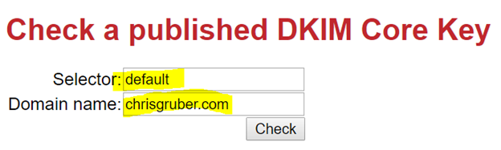

**DomainKeys Identified Mail** or DKIM, as it is called, is an **email authentication method** that essentially acts as something of an email driver’s license for an Internet domain. It is one popular method for a SMTP mail server to separate credible senders of email messages from spam. If you own your own internet domain name and operate your own SMTP mail server then you will want to make sure that your domain’s DKIM and SPF DNS records are valid and correctly published by DNS (domain name server). Otherwise, the email messages you send from your mail server will likely end up in your recipient’s spam folder or, worse, rejected for delivery all together. In this article, I will focus on showing you how to validate your DKIM record.

##How DKIM Works

When you send an email message to someone else, your message is transported over the internet traveling from mail server to mail server via SMTP. When your message finally arrives at your recipient’s mail server, the mail server will process your message and determine whether it is spam or not using one or more email authentication methods, like DKIM. To do this, your email message’s header will have a DKIM signature like the example one depicted below:

The highlighted parts of this signature shows a **“d” tag** that is the internet domain this email message was sent from (the domain name of your SMTP mail server) and it also has a **“s” tag** (or **“selector”**, as it is called) that is the name of the published DKIM record from the domain we see in the “d” tag. Using this information, the receiver’s mail server queries DNS to get the published DKIM record that contains the published RSA public key and then that public key use used to decrypt the hash value in the header field. It is also used to recalculate the hash (the “bh” tag) and then compares these two. If they are a match then the message is valid. If they do not match, then this message will be considered as spam and be treated accordingly (sent to the spam folder or rejected from being delivered, etc.)

Also, note that when the receiver’s mail server looks up the DKIM key in our example it also uses the **“q” tag** to look for a DKIM key with a name that matches the “s” tag and is a TXT DNS type record as the “q” tag specifies, which is **“dns/txt”**.

Now that we have a primer, let’s take a look at how to validate a real internet domain’s DKIM record!

##Validating Your Internet Domain’s Published DKIM Record

So now drop out to your favorite terminal or command prompt and lets use our “nslookup” console command:

Now, set the query type to DNS TXT records and then query for your domain name. In my example, I am using my internet domain name, **“chrisgruber.com”**.

This will produce only my published SPF record, which we are not interested in for this example. However, if you next type a query that follows this format:

**“<selector>.\_domainkey.<domain.com>”**

You will retrieve your DKIM record. So for my example, I will type “default.\_domainkey.chrisgruber.com” because “default” is the DKIM key name specified in the “s” tag (“selector” tag) and “chrisgruber.com” was the value specified in the “d” tag.

Success! To validate the DKIM record we can now see is published, we can use any one of many online DKIM validators. One that I use is available for free at:

Here I can specify the name of my DKIM key and the domain name it is published by:

And this will provide me with the following quick report that shows I have a well constructed and publicly available DKIM key in my DNS zone:

Another resource I like to use is made available by a message systems company called port25. I am not associated with this company and I am not promoting them beyond simply using a tool they make available to the public that gives you really good information about how your email authentication is configured. Again, I will focus in on only DKIM email authentication:

So, assuming you don’t mind sending your email address to port25's Authentication Checker service, compose an email addressed to their service's email address that I circled in red in the above screenshot. After a few minutes, port25's service will send a reply to your email message that will have a very detailed report of your mail server's email authentication support.

Here is a snippet from the very good report they sent to me for my domain, chrisgruber.com:

Further down in the report is a section that is specific to my DKIM configuration they analyzed:

Thank you to port25 for making this very useful tool available!

I hope this article was helpful for you and now you understand what DKIM is and how it works. Please share your experiences in my comments section!
